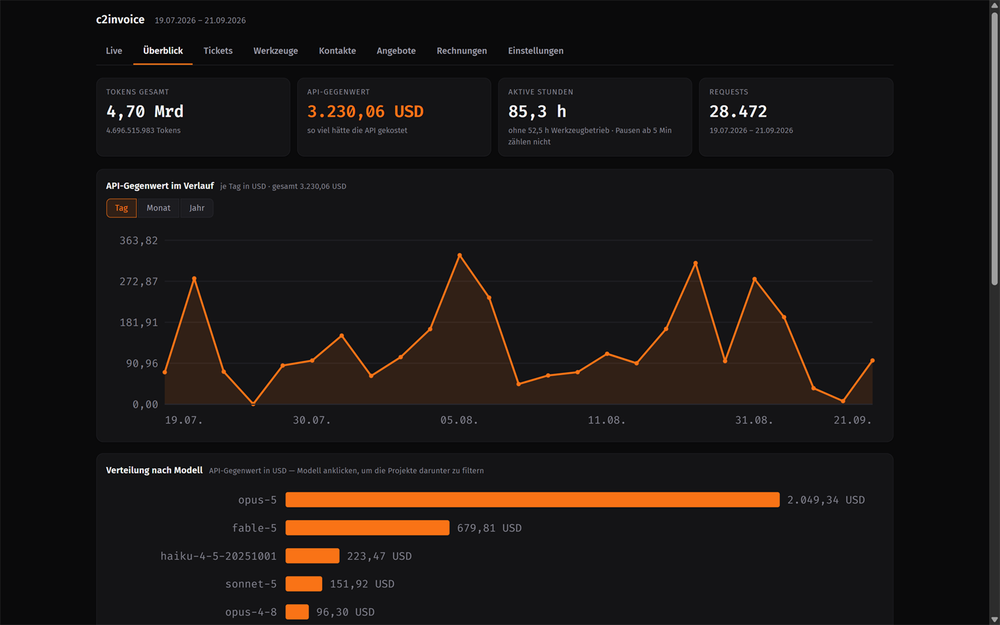
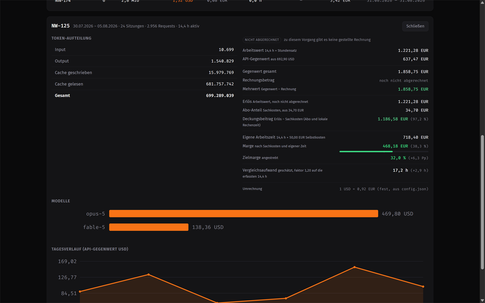
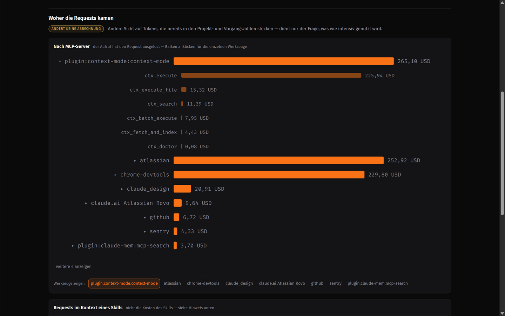
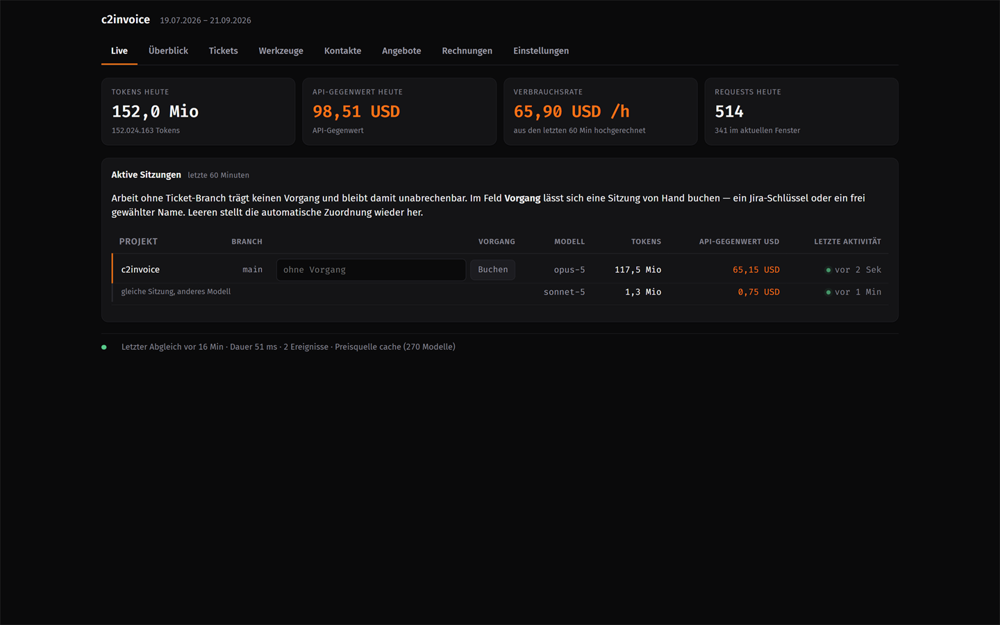

# c2invoice

**Turn Claude Code usage into an invoice.**

Local time tracking, cost analysis and invoicing for freelancers who work with
Claude Code. It reads the session logs, reconstructs actual working time, and
produces an invoice PDF. No cloud, no account, no telemetry.


Token counters tell you what you consumed. `c2invoice` answers the question a
freelancer actually has: *what can I bill for this, and what's left after
costs?*

It reads Claude Code's session logs after they are written — no hooks, no
wrapper, no interference with running sessions, and **it costs you zero extra
tokens**. Everything runs locally on `127.0.0.1`; nothing is uploaded anywhere.

```
session logs → active working time → hourly value → margin → invoice PDF
```

## What it looks like



Per job — the margin bar is scaled against your target margin, so "above or
below what I aimed for" is readable at a glance:



Where the tokens actually went — MCP servers and skills as ranked bars. Open a
server to see its individual tools, drawn at the same scale as their parent:



Live, while you work — sessions can be booked onto a job by hand:



*Screenshots use anonymised project, job and tool names.*

## Why this exists

Every tool in this space (ccusage, claude-code-templates, ccgauge, sniffly,
opcode) answers *how many tokens did I burn and what would the API have cost*.
None of them answer *what do I put on the invoice*. Between those two questions
sit four steps:

1. **Usage → working time.** Tokens are not hours. Timestamps in the log
   reconstruct actual active time once you drop the gaps where the AI waited
   for you. Measured on real data: a 9.1-hour span was 1.6 hours of work — 82%
   was waiting.
2. **Working time → revenue.** Hourly rate per client, discounts, and the work
   assigned to the right job.
3. **Revenue → margin.** The API list price is not your cost. Your subscription
   is, proportionally — and above all, your own working time is.
4. **Margin → invoice.** Sequential numbering, legally required fields,
   immutable issued documents, cancellation instead of deletion.

*Published as `devbill` until version 1.0. Renamed in 1.1 to avoid confusion
with an unrelated commercial product of the same name. Same tool, same repo —
the old GitHub URL redirects here, and nothing in your setup needs changing.*

## Quick start

```bash
git clone https://github.com/RobSpct/c2invoice.git
cd c2invoice
cp config.example.json config.json     # Windows: copy config.example.json config.json
npm start                              # http://127.0.0.1:4747
```

Requires **Node 22.5 or newer** (uses the built-in `node:sqlite`), tested on
Node 24. **Zero dependencies** — there is no `npm install` step.

Session files are read from `~/.claude/projects` by default. That path works
on every platform, so there is normally nothing to set. If your logs live
elsewhere, point `jsonlDir` at them. If the directory cannot be found, the
server says so on startup instead of quietly reporting zeros.

Everything else has working defaults. Issuing invoices additionally requires
your business details under `rechnung.aussteller` — until those are filled in,
invoice creation refuses to run rather than producing an invalid document.

`config.json` is deliberately not tracked by git: it holds your business
address, rates and credentials.

```bash
npm test               # self-check of the calculation logic
node ingest.js         # ingest only, no server
npm run proxy          # only if you also meter local models via Ollama
```

## Works with any issue tracker

**No tracker is required at all.** Jobs can be free-form names — you can book
any session onto `WEBSHOP-RELAUNCH` by hand from the Live tab, and it flows
through reporting and invoicing like anything else.

If you *do* use a tracker, there are two independent layers:

**1. Recognition — already tracker-agnostic.** Job keys are detected from the
git branch name via a configurable regular expression:

```json
"ticketRegex": "([A-Z][A-Z0-9]{1,9}-\\d+)"
```

The default matches Jira (`PROJ-123`), **Linear** (`ENG-123`), Shortcut, YouTrack
and anything else using the `ABC-123` convention — unchanged. For a different
scheme (Trello card IDs, GitHub issue numbers), adjust the regex. The rest of
the pipeline treats the job key as an opaque string and never inspects it.

**2. Push-back — one adapter per tracker.** Writing results *back* into your
tracker as a comment is inherently tracker-specific: every API differs, so an
API key alone is not enough. `jira-sync.js` is the reference implementation and
is ~400 lines. A new adapter needs to expose `run({ db })` and gets wired into
one place in `server.js`. Contributions welcome — Linear and Trello are the
obvious next candidates.

Jira is fully optional: set `jira.enabled: false` and the entire tool works,
with the sync endpoint, background job, deep links and UI elements all disabled.

## What it measures

| Figure | Meaning |
|---|---|
| Tokens | Input, output, cache-read and cache-write, deduplicated per request |
| API equivalent | What the same usage would have cost at API list prices |
| Subscription share | Your actual cost — the plan price spread over measured usage |
| Active time | Working time with idle gaps removed (configurable, default 5 min) |
| Work value | Active time × hourly rate, per client and per job |
| Contribution margin | Work value − direct costs |
| Margin | Contribution margin − (hours × your own cost rate) |

Every figure carries its reference in the label. Not "margin", but "margin —
after direct costs and own time". A missing cost block is invisible otherwise.

### Where the tokens went

Beyond *how much*, the Tools tab answers *what consumed it*. Requests are
attributed to the MCP server that triggered them and to the skill that was
active at the time, each as a ranked bar chart; a server can be opened to show
its individual tools. On real data this surfaced that a single context tool
accounted for the bulk of one server's spend — the kind of thing a flat list of
a hundred rows hides.

Two separate lists on purpose: an MCP server *causes* the request, so the
tokens are genuinely its own. A skill does not — it adds text to a request that
was happening anyway. Its row says *how much ran while this skill was active*,
not *how much the skill cost*. Read as cost attribution, that number would be
wrong, so the tab says so rather than letting you assume otherwise.

This section changes no billing figure. It is marked as such in the interface,
because the numbers above it do feed invoices and the difference matters.

### Accuracy

Claude Code writes the same API request to the log **multiple times** (one line
per content block, all carrying identical usage figures). Summing naively
overcounts by more than 100%. `c2invoice` keeps only the latest state per
`requestId`. Verified against `ccusage` over a full month: **0.02% deviation**
($2076.67 vs $2076.65).

### Local models

Local models (Ollama and anything speaking its API) produce no billing data of
their own. An optional proxy sits between your tool and Ollama and records
usage, which is then billed at a configurable flat rate per million tokens
rather than invented API prices.

## Invoicing

- Sequential numbering per year (`2026-0001`), enforced by a unique constraint
- **Issued invoices are immutable**: positions, issuer and amounts are frozen as
  a JSON snapshot at creation time. Correcting an hourly rate later cannot
  retroactively alter a document you already sent.
- Never deleted, only cancelled — the original is marked void, the correction
  gets its own number with negative amounts
- PDF export via headless Chrome or Edge, no extra dependency
- Quotes have their own separate numbering, so an unaccepted quote never leaves
  a gap in your invoice sequence

**Jurisdiction note:** the invoicing module implements **German** requirements
(§ 14 UStG mandatory fields, § 19 small-business exemption, 19% VAT). VAT rate
and small-business status are configurable, but the required-field logic assumes
German law. If you extend this for another country, please make it configurable
rather than replacing it.

## Language

The interface speaks **English and German**. Pick one under Settings; the
choice is remembered per browser, and numbers and dates follow it.

The **invoice document stays German** on purpose. German invoicing law ties
its mandatory fields to German terms, so a translated invoice would not be
legally sound. Only the interface is translated.

Source comments and configuration comments remain German.

## Optional: run it in the background (Windows)

`integration/autostart.ps1` registers a scheduled task that keeps the server
running and restarts it if it dies. `integration/start-hidden.vbs` starts it
without a console window. Both are optional; `npm start` is enough.

## Roadmap

- Linear and Trello sync adapters
- Partial billing of long-running jobs across month boundaries

## Contributing

See [CONTRIBUTING.md](CONTRIBUTING.md). Short version: no dependencies, every
calculation gets a check that actually fails when the logic breaks, and tests
must not depend on your own `config.json`. Tracker adapters are the most
useful thing to contribute right now.

## License

AGPL-3.0. If you modify this and offer it as a service, your changes must be
made public.
